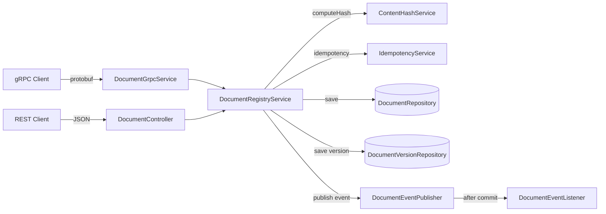

# grpc-registry-service

Document Registry with gRPC API, Versioning, Tracing and Idempotency

## What It Does

A document registry exposing both **gRPC** and **REST** APIs. Built with Spring Boot 3 + Java 21. Core capabilities:

- **Dual-protocol API** – full gRPC service (`DocumentRegistryService`) + REST controller on the same service layer
- **Document versioning** – full audit trail of every content change, per-document version history
- **Content hash verification** – SHA-256 fingerprinting prevents silent tampering and detects duplicate uploads before storing
- **Distributed tracing** – `X-Trace-Id` / `X-Span-Id` / `X-Parent-Span-Id` propagation across service boundaries
- **Idempotency** – `idempotency_key` on creates replays the original response on retries (true idempotency, not duplicate rejection)
- **Event-driven audit** – domain events published after successful transaction commit via `@TransactionalEventListener`

## Practical Use Cases

- **Government document registries** – immutable audit trail, revocation support, content integrity proof
- **Compliance archives** – PUBLISHED → ARCHIVED lifecycle with event log; content hash as tamper evidence
- **Contract management** – version history with changelog, optimistic locking prevents lost updates under concurrent edits
- **Microservice integration** – gRPC for low-latency service-to-service calls, REST for external/browser clients

## Design Decisions

| Mechanism | What it solves |
|---|---|
| gRPC + REST dual API | gRPC for inter-service performance, REST for external consumers — shared service layer |
| Protobuf schema (`document_registry.proto`) | Strongly-typed contract between services, backward-compatible evolution |
| `GrpcExceptionConverter` | Maps domain exceptions to proper gRPC Status codes (NOT_FOUND, ALREADY_EXISTS, FAILED_PRECONDITION) |
| Idempotency key store with replay | Duplicate requests under retry storms — replays the original response instead of rejecting |
| SHA-256 content dedup + unique constraint | Prevents storing byte-identical documents; O(1) hash index lookup backed by DB unique constraint |
| `@TransactionalEventListener` audit trail | Audit events fire only after successful commit — no false audit records on rollback |
| Optimistic locking (`@Version`) | Concurrent updates to the same document fail fast instead of silently overwriting |
| Response DTOs | REST API contract decoupled from JPA persistence model |

## Architecture



## Document Lifecycle

```
DRAFT ──→ PUBLISHED ──→ ARCHIVED
                   └──→ REVOKED
```

State transitions enforced by explicit transition table in `DocumentStatus`:

| From | Allowed targets |
|---|---|
| DRAFT | PUBLISHED |
| PUBLISHED | ARCHIVED, REVOKED |
| ARCHIVED | _(terminal)_ |
| REVOKED | _(terminal)_ |

## gRPC API

Proto definition: [`src/main/proto/document_registry.proto`](src/main/proto/document_registry.proto)

| RPC | Request | Response |
|---|---|---|
| `CreateDocument` | title, content, idempotency_key | DocumentResponse |
| `GetDocument` | document_id | DocumentResponse |
| `ListDocuments` | page, size | ListDocumentsResponse |
| `PublishDocument` | document_id | DocumentResponse |
| `ArchiveDocument` | document_id, reason | DocumentResponse |
| `RevokeDocument` | document_id, reason | DocumentResponse |
| `AddVersion` | document_id, content, changelog, created_by | DocumentVersionResponse |
| `GetVersionHistory` | document_id, page, size | GetVersionHistoryResponse |
| `VerifyContentHash` | document_id, content | VerifyContentHashResponse |

gRPC error mapping: `EntityNotFoundException` → `NOT_FOUND`, `DuplicateContentException` → `ALREADY_EXISTS`, `InvalidStatusTransitionException` → `FAILED_PRECONDITION`

## REST API

| Method | Path | Description |
|---|---|---|
| `POST` | `/api/v1/documents` | Create document (supports `Idempotency-Key` header) |
| `GET` | `/api/v1/documents` | List all (paginated) |
| `GET` | `/api/v1/documents/{id}` | Get by ID |
| `POST` | `/api/v1/documents/{id}/publish` | DRAFT → PUBLISHED |
| `POST` | `/api/v1/documents/{id}/archive` | PUBLISHED → ARCHIVED |
| `POST` | `/api/v1/documents/{id}/revoke` | PUBLISHED → REVOKED |
| `POST` | `/api/v1/documents/{id}/versions` | Add new version |
| `GET` | `/api/v1/documents/{id}/versions` | Version history (paginated) |
| `POST` | `/api/v1/documents/{id}/verify` | Verify content hash |

REST errors use RFC 7807 `ProblemDetail` format. All responses include tracing headers.

## Profiles

| Profile | Database | DDL | H2 Console | Log Level |
|---|---|---|---|---|
| `dev` (default) | H2 in-memory | `create-drop` | enabled | DEBUG |
| `test` | H2 in-memory (separate) | `create-drop` | disabled | WARN |
| `prod` | _(configure datasource)_ | `validate` | disabled | INFO |

## Running

```bash
./gradlew bootRun
# REST API: http://localhost:8200/api/v1/documents
# gRPC:     localhost:9090
# H2 console: http://localhost:8200/h2-console (dev profile only)
```

## Testing

```bash
./gradlew test
```

## Tech Stack

- Java 21, Spring Boot 3.2
- **gRPC** + Protobuf 3 (`grpc-spring-boot-starter`)
- Spring Data JPA + H2 (dev/test; swap to PostgreSQL for production)
- Jakarta Validation, Spring MVC
- Lombok (`@Getter`, `@RequiredArgsConstructor`, `@Slf4j`)
- JUnit 5, MockMvc, AssertJ
